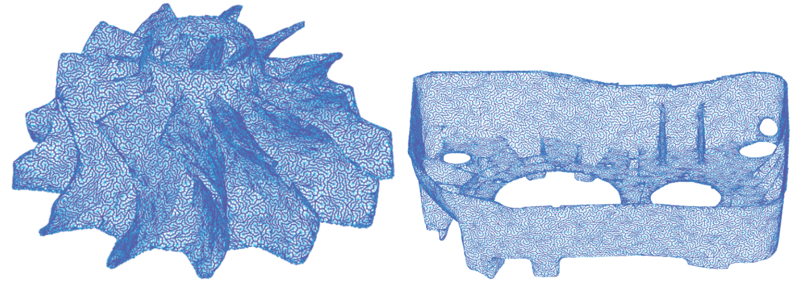

# Non-revisiting Uniform Coverage (NUC)

[(To use this algorithm in ROS, see this ROS package)](https://github.com/ZJUTongYang/nuc_ros)

[(To use this algorithm in ROS2, see this ROS2 package)](https://github.com/ZJUTongYang/nuc_ros2)

[(ONGOING: We are actively developing a benchmarking platform for 3D surface coverage and this algorithm must be there)](https://github.com/ZJUTongYang/benchmarking_3dcpp)

This repository contains the supplementary materal (code and video) for the journal paper entitled "Template-free Non-revisiting Uniform Coverage Path Planning on Curved Surfaces", IEEE/ASME Transactions on Mechatronics (T-Mech). 

[Paper Link](https://www.researchgate.net/publication/371391703)

This paper claimed that a physically uniform coverage path should be designed based on a physically uniform representation of the target surface, such as a triangular mesh, rather than enforcing a curvilinear coordinate. 
Typically resultant coverage paths generated by the proposed algorithm are as follows: 



The supplementary code in this repo is capable of generating the non-repetitive coverage path on ARBITRARY connected triangular mesh. Input a uniform mesh, and you will get a uniform coverage. 

The C++ code has also been wrapped to python for easy usage. 

## Video Link

[Supplementary Video](https://drive.google.com/file/d/1sYnp-nKgyRzVhqUaI8ly20HRpIq9SC3B/view?usp=sharing)

## Dependencies (for ubuntu)

1. pybind11
```
sudo apt-get install python3-pybind11
```

2. trimesh (if you need the python script to read a .stl model)
```
pip3 install trimesh
```

## Usage

1. Compile the C++ code into python
```
mkdir build
cd build
cmake ..
make
```
This will create a python module named nuc_tmech23. 

2. Run the demo python file
```
python3 main.py
```
and you will get three .txt files, storing the inputs (vertex indices of the mesh facets, and the 3D location of the vertices) and the outputs (the 3D location of the coverage path). 

3. Run the MATLAB script for visualisation
```
visualisation.m
```
and you will be able to see a coverage path designed for a saddle-shaped surface. 

## Bug Report

The code does not have any randomness so bugs can be easily reproduced. If your surface triggers a bug in my code, please send the mesh data to me. 

## Cite This Paper
```
@article{Yang2023Template,
  title={Template-Free Nonrevisiting Uniform Coverage Path Planning on Curved Surfaces},
  author={Yang, Tong and Miro, Jaime Valls and Nguyen, Minh and Wang, Yue and Xiong, Rong},
  journal={IEEE/ASME Transactions on Mechatronics},
  year={2023},
  publisher={IEEE}
}
```


